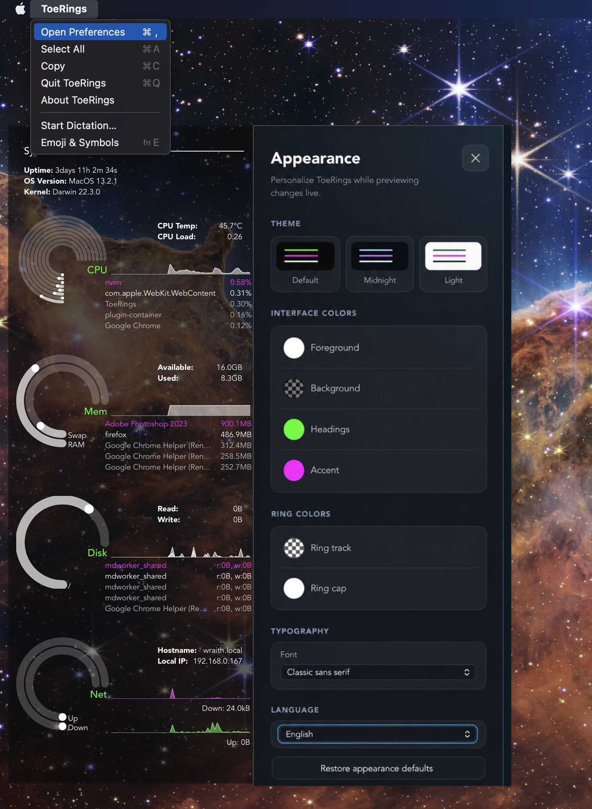

# ToeRings

A theme-able system monitoring tool.

[]()
[]()
[]()
[]()


I tried to port the [Seamod](https://github.com/maxiwell/conky-seamod) Conky theme to Tauri.
I copied a lot of the Rust code from [Bottom](https://github.com/ClementTsang/bottom).

The name "ToeRings" just sounds like Tauri, and contains the word "rings".

## Install on Linux

Download the package for your distribution from the GitHub release assets.

Debian and Ubuntu:

```sh
sudo apt install ./ToeRings_*_amd64.deb
```

Fedora and other RPM-based distributions:

```sh
sudo dnf install ./ToeRings-*.x86_64.rpm
```

The AppImage runs without installation:

```sh
chmod +x ToeRings_*_amd64.AppImage
./ToeRings_*_amd64.AppImage
```

## Install on Windows

Install ToeRings with [Scoop](https://scoop.sh/) from the
[ChrisLauinger77 bucket](https://github.com/ChrisLauinger77/scoop-bucket):

```powershell
scoop bucket add ChrisLauinger77 https://github.com/ChrisLauinger77/scoop-bucket
scoop install ChrisLauinger77/toerings
```

Alternatively, download the NSIS installer or portable ZIP from the GitHub release assets.

## Install on macOS

Install ToeRings with [Homebrew](https://brew.sh/):

```sh
brew trust ChrisLauinger77/cask
brew install --cask chrislauinger77/cask/toerings
```

Alternatively, download the Apple Silicon or Universal bundle from the GitHub release assets
and move `ToeRings.app` to the Applications folder.

The macOS builds are ad-hoc signed, but they cannot be notarized without a paid Apple
Developer Program membership. On first launch:

1. Control-click `ToeRings.app` in Finder and choose **Open**.
2. Confirm **Open** in the security dialog.

If macOS still blocks the app, open **System Settings → Privacy & Security**, find the
ToeRings message, and choose **Open Anyway**. As a final option, remove the quarantine
attribute from a build you downloaded from this repository and trust:

```sh
xattr -dr com.apple.quarantine "/Applications/ToeRings.app"
```

## Install from Source

You can build the executable locally. This requires Node.js 24 or newer and Rust 1.95 or
newer.

```sh
git clone https://github.com/ChrisLauinger77/toerings.git
cd toerings
npm i
npm run tauri build
```

## Configure

There is a preferences panel which is accessible from the app menu.



## Run in Development

```sh
npm i
npm run tauri dev
```
